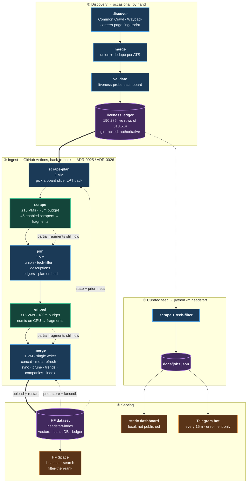

# HeadStart

[](https://github.com/sarthakjain004/headstart/actions/workflows/ci.yml)
[](https://github.com/sarthakjain004/headstart/actions/workflows/pipeline.yml)
[](./docs/adr/)
[](./pyproject.toml)
[](./LICENSE)

### Every opening. Straight from the source.

**468,376 software-engineering roles**, read directly from the companies' own hiring boards.

Not from a feed employers had to opt in to. Not from a list ranked by who paid.

**[Search the index](https://imposeidon-headstart-search.hf.space)** (free; Google sign-in) ·
**[Read the decisions](./docs/adr/)**

---

### It costs nothing to run. All of it.

Discovery. 47 scrapers. Embeddings. Vector search. Email and Telegram alerts.

Fork it, add your tokens, and the whole pipeline is yours — running on free tiers, end to
end. No card. No trial. Not a stripped tier of something else: the same code that serves the
index above.

### Ask for the job. Not the keywords.

"Backend engineer at a climate startup" is a query here.

Semantic search over local embeddings, with the structured filters — years, salary, remote,
employment type — left exactly where they belong: under your control, not inferred from a
sentence.

### 34 ATSes. One shape.

Greenhouse, Workday, Lever, Ashby, iCIMS, Oracle, Taleo, BambooHR, Phenom, and 24 more, plus eight
companies' own career sites.
HeadStart finds which companies host boards on which ATS, checks that each board is alive,
and normalizes every posting into a single `Job`. You never learn an ATS's name.

### Everything above is measured.

And every limit ships next to the result it qualifies. 200 ADRs record the options that lost,
not just the one that won. When a later measurement contradicts an earlier one, the ADR is
amended in place rather than quietly edited.

---

It serves two ways: the **AI semantic-search layer** above, and **job alerts** — saved
searches delivered by email or Telegram to signed-in accounts. Everything runs on free tiers
(see *What this optimises for*, below).

## Why

LinkedIn is not a comprehensive mirror of the job market. Employers have to *opt in* to push
roles there (via ATS integrations / "job wrapping"), and that path is gated and often skipped. So
two kinds of roles slip through: ones LinkedIn never gets because the employer never syndicated
them, and ones it gets late or buries below paid listings. Reading the ATS directly catches both.
The target is companies **worldwide**, focused on **software-engineering / tech roles**; the long
tail of smaller employers (India among them) is just where the LinkedIn gap is widest.

## Search the index

The search design is a **hybrid split made explicit at the UI**: you apply structured filters
yourself, *and separately* type a natural-language query describing only the role. Filters drive
a deterministic where-clause; the query drives the embedding. `/search` takes `remote`,
`has_salary`, `max_years`, `ats`, `etype`, `india`, `location`, `company`, `posted_within`,
`seen_within`, and explicit date bounds — all compiled by `search_filters.compiler.build_filter`, which rejects
unparseable input with a 400 rather than silently ignoring it.

- **Embeddings:** `nomic-embed-text-v1.5`, 768-dim, L2-normalized, over `title + cleaned
  description` — structured fields ride alongside as filterable metadata, never inside the vector
  (ADR-0006).
- **Store + retrieval:** LanceDB, embedded and local, does filter-then-rank in one query —
  pre-filter on typed metadata, rank the survivors by cosine (ADR-0007, ADR-0008). Required
  years-of-experience is extracted to a numeric range by a deterministic cascade, so `min_years`
  is a real filter rather than a guess (ADR-0009, ADR-0018).
- **Freshness:** the index is reconciled incrementally, never rebuilt. New postings are added,
  closed ones are evicted, and metadata already in the table gets corrected as fresher scrapes
  arrive — so a fix reaches rows indexed long ago, not only new ones (ADR-0014, ADR-0061, ADR-0062).
- **Signed in:** the full UI sits behind Google sign-in (`SECRET_KEY` + `GOOGLE_CLIENT_ID`,
  ADR-0042). Signing in unlocks three per-account tabs: **Matches** (saved searches, one of which
  can become an email Subscription), **Saved** (starred jobs), and **Profile** (paste a résumé;
  one LLM call extracts a career record and a role-describing query, editable before it runs — the
  query stays role-only, since years/salary belong to filters).

## ATS coverage

**47 scrapers**, selected from a registry by the `ats` key: `adp`, `adp_recruiting`, `amazon`, `apple`, `ashby`,
`bamboohr`, `breezy`, `bytedance`, `clearcompany`, `cornerstone`, `darwinbox`, `eightfold`, `freshteam`, `gem`, `google`, `greenhouse`,
`icims`, `jazzhr`, `jibe`, `jobvite`, `join`, `keka`, `lever`, `meta`, `oracle`, `peoplestrong`, `personio`, `phenom`,
`pinpoint`, `pyjamahr`, `recruitee`, `ripplehire`, `rippling`, `sensehq`, `smartrecruiters`, `successfactors`,
`taleo_be`, `taleo_enterprise`, `teamtailor`, `tesla`, `tiktok`, `trakstar`, `uber`, `workable`,
`workday`, `zoho`, `zwayam`. All but `join` are active: `join`'s boards run ~1 tech job in ~10k (German-SMB
listings, almost entirely non-tech), pure noise for a tech-only index, so `registry.DISABLED_ATS`
skips it — the scraper class and tests stay intact, and re-enabling it is a one-line change.
`adp` and `adp_recruiting` are two separate ADP products, ADP Workforce Now and ADP Recruiting
Management, each with its own host, API and Board identity.

Eight of the 47 — `amazon`, `apple`, `bytedance`, `google`, `meta`, `tesla`, `tiktok`, `uber`
(ADR-0139) — are **Single source scrapers**: each company's own in-house careers system, not a
multi-tenant platform, so there's no discovery step and each carries a fixed, hand-entered slug
rather than a crawled tenant roster. `phenom` is a career-site skin over other ATSes rather than a
platform of its own, so its ledger is deliberately narrow — only tenants whose backing board
(Workday, SuccessFactors, ...) this repo does not already hold, kept out of the estate-wide dedupe
that would otherwise serve them twice under two ATS labels (see `phenom.py`'s module docstring).
`jibe` is iCIMS's own career-site layer, so it drops, posting by posting, whatever an iCIMS tenant
the `icims` scraper can read already serves, and it reads each client host at the `crawl-delay`
its robots.txt states (ADR-0189).

Each scraper reads a Board and normalizes its raw postings into `Job` records; all HTTP routes
through one pooled, thread-local `curl_cffi` client that impersonates Chrome, so the same stack
serves plain JSON APIs and TLS-fingerprinted (Cloudflare / DataDome) boards alike (ADR-0002). A
Board's `company` name is read off the board page itself where the ATS makes that possible
(`ashby`, `eightfold`, `gem`, `jibe`, `jobvite`, `keka`, `lever`, `phenom`, `pinpoint`, `ripplehire`,
`taleo_enterprise` — ADR-0114); `breezy` needs no page for it, because every posting in its
listing carries the employer's own `company.name`, `adp` (ADP Workforce Now) reads its client
name out of the career center's `client-features` JSON (ADR-0180), since its page title is the
literal "Recruitment", and `adp_recruiting` (ADP Recruiting Management, a separate ADP product)
reads `clientName` off the career-site record it already fetches for its token (ADR-0202), and
`workday` votes one name out of its postings' `hiringOrganization` legal entities, checked against
its board page and cached per Board in `data/validate/company_names/workday.csv` (ADR-0216). The
eight **Single source scrapers** above need no page fetch for
it: one fixed company each, so the name is declared as `BaseScraper.COMPANY` and always served.
No Board is served under its **ATS slug** (ADR-0212). A hand-curated name in
`config/company_names.csv` overrides every source; an all-caps legal name is title-cased; and a
Board no source names is served under its humanised tenant (`nvidia.wd5.myworkdayjobs.com/…` is
"Nvidia", `careers-gd-ais.icims.com` is "GD AIS"), or under no name at all where that tenant is only
a vendor's code (Oracle's pods, ADP's GUIDs). A name is a display value, never an identity, which
is why `CompanyPrefs` is keyed by **board_key** and never by company name.

The liveness pipeline has probed **310,514 ledger rows**: 190,285 live, 103,274 dead, 16,955 unknown
— rows, not boards; they collapse to 183,649 Unique Boards once duplicate spellings of the same
board are folded together and the 4 with a `dead` row newer than their newest `live` row are dropped (`CONTEXT.md` §Counting
Boards).

## What this optimises for

Six commitments show up in almost every design decision here, and they explain choices that would
otherwise look strange.

**Measure it; don't reason about it.** Claims about how a remote host behaves are settled by
hitting the host, not by reading code. This is a rule with a scar behind it: a "probe the host root
to tell dead from empty" guard looked obviously correct and died on contact, because 9 of 12 boards
the ledger already called dead answered `GET /` with 200. Findings carry their sample size.

**Record the rejected options, not just the chosen one.** 200 ADRs, **135** carrying a heading that
weighs alternatives (`grep -lEi '^#{2,3} .*(alternativ|options? (considered|rejected)|rejected)'
docs/adr/`). When a later measurement contradicts an earlier one the ADR is amended or superseded
in place rather than quietly edited — **57** name an `Amends:` / `Supersedes:` relationship in
their header — so the reasoning stays auditable even when it turns out to be wrong.

**Publish the limits next to the result.** Coverage tables say what is excluded and why. A number
without its caveat is treated as a defect.

**Degrade where degrading is possible.** A missing binary, an unregistered client, a walled
origin: the spare egress returns "not available" and leaves the caller on the path it already had,
because a fallback is worth having only if its absence costs nothing. Not universal — the LLM
router and browser-automation seam raise instead, because a stage that silently proceeds without
its inputs would publish a wrong answer rather than no answer.

**Recall over precision, where the two conflict.** The tech filter tolerates non-tech creep and
refuses to drop a real tech job. An independent LLM gate exists to audit the *discarded* pile —
run by hand, not wired into the pipeline, so treat it as a tool that has been used rather than a
check that runs.

**Cost is a design constraint, not an afterthought.** The whole system runs on free tiers, so
storage and minutes bound the architecture directly — why compaction runs on its own schedule
instead of inside every ingest cycle, why embedding shards across many VMs, and why a run takes a
bounded slice of boards rather than scraping exhaustively (weighted toward high-yield boards, with
a rotating tail so a newly-productive board can never starve).

## How it works

Two halves share the `Job` model. A discovery pipeline finds and validates boards; a scheduled
ingest pipeline reads them and keeps the search index fresh.



Green stages are matrix fan-outs across many **GitHub VMs**; blue are single-VM serial stages;
purple are stored state. Thick `==>` edges are the main path. Dotted edges are the two things
easy to miss: state each stage *reads back* from the HF dataset, and the partial-work guarantee —
a shard that hits its time budget still forwards whatever it finished.

**Discovery** runs occasionally and by hand; its output, the liveness ledger under
`data/validate/liveness/`, is committed to git and is what the ingest pipeline reads.

**Ingest** (`.github/workflows/pipeline.yml`) runs back-to-back as five stages, two of them matrix
fan-outs capped at 15 concurrent GitHub VMs. A run-level `concurrency` group serializes whole
runs so two never race on the dataset.

**Serving** has two independent paths. The search index is the single-writer end: `merge` uploads
to the private HF dataset `imPoseidon/headstart-index` and restarts the Space
`imPoseidon/headstart-search`. Separately, `python -m headstart` scrapes the same ledger and writes
`docs/jobs.json`, which the static dashboard reads. The two paths share the `Job` model and the
tech filter but run on their own schedules.

Both fan-out stages (`scrape`, `embed`) are time-budgeted and bank partial work by design: a
killed shard's fragment still uploads, and whatever it finished moves on to the next stage — the
unfinished boards or Docs simply reappear in the next run's plan.

### Tech-only, English-only

Every job is scraped, but only tech roles are embedded, indexed, and shown. A recall-biased regex
filter derives the tech subset from the full scrape — roughly a fifth of all scraped postings pass,
though the rate swings hard by ATS (tech-focused platforms like Ashby or Eightfold run 40%+; large
general-purpose enterprise ATSes like Workday or SuccessFactors run closer to 15%). A non-tech job
creeping in is acceptable; dropping a tech job is not, so a two-part verification gate guards
recall: a deterministic self-consistency check plus an independent LLM reasoning gate that judges a
sample of the *dropped* pile and flags anything the regex missed (ADR-0017). A language-detection
gate then holds non-English descriptions out of the index before embedding — the scrape and the
curated feed keep them; only retrieval is English-only.

No always-on server: scheduled GitHub Actions and a free-tier Space.

### Which boards a run picks

A run does not scrape every board it could. The liveness ledger's headline number reduces through
several filters before it reaches what a run can even consider — `registry.DISABLED_ATS`,
vendor test/sandbox boards, aliases (one board serving two hostnames, a career section or site whose
every posting another of the same tenant already lists, or an Eightfold career site whose backing
ATS board already serves it), case-variant duplicate spellings, boards whose newest probe says
`dead`, and real boards deliberately parked — most of them Jibe career sites whose every posting
another board we scrape already serves, a few because their cost dwarfs their tech yield, two
because what they serve is near-duplicate spam. `CONTEXT.md`'s
§Counting Boards names each of these stages precisely, and `tests/test_board_counts.py` keeps this
table in lockstep with the committed ledger:

| | boards | |
| --- | ---: | --- |
| live rows in the ledger | 190,285 | a row, not a board — 6,632 of them are duplicate spellings |
| − `registry.DISABLED_ATS` | −25,488 | all of it `join` |
| − `excluded_and_parked.EXCLUDED_BOARDS` | −212 | vendor test/sandbox/demo boards and one historical feed, confirmed by reading their postings |
| − alias ledger | −1,170 | one board under a second hostname or label, a career section or career site another of the same tenant already covers, or an Eightfold career site its backing ATS board already serves (ADR-0111, ADR-0182, ADR-0186, ADR-0202, ADR-0205, ADR-0222) |
| − case-variant dedupe | −6,629 | `company/External` and `company/external` are one board (ADR-0023) |
| − newer `dead` row | −4 | a board is read only if no `dead` row is newer than its newest `live` one; all 4 re-probed dead (ADR-0219) |
| − `excluded_and_parked.PARKED_BOARDS` | −301 | real boards withheld for now — five for scrape cost, two for near-duplicate spam, six Jibe clients whose every posting is on a Workday or Oracle board already held, 288 whose every posting is on an iCIMS board we scrape (ADR-0240) |
| = **Scrapable Board** | **156,481** | |

That order matters: excluding before deduping reads −212 and −6,629, deduping first reads −209,
because three excluded boards were themselves duplicates. Both land on 156,481.

Of those, **103,188 are currently hiring** — the 53,293 live-but-empty boards are skipped as having
nothing to read. A run takes a bounded slice and splits it between a scored head (top boards by a
sticky measure of tech-job yield, large enough to hold every board that yields tech) and a tail
that rotates through everything else, the boards looked at longest ago first, so
newly-productive boards can never starve and eviction keeps working on boards outside the head.
A small reserved slice specifically targets boards holding jobs whose descriptions were never
successfully captured, so the years-of-experience extraction on those can eventually be repaired.
Boards a run skips are simply left alone — eviction is scoped to boards actually present in a
given scrape, so a partial harvest never damages what it didn't look at.

### The served table

One row per Job in the LanceDB `jobs` table — the only thing the Space reads. Defined by `_schema()`
in [`src/headstart/ingest/index.py`](src/headstart/ingest/index.py); `tests/test_readme_schema.py`
fails if this table drifts from it.

| column | type | notes |
| --- | --- | --- |
| `id` | string | `{ats}:{slug}:{native_id}` — the Board key is everything before the last `:` |
| `ats` | string | `greenhouse`, `workday`, `ashby`, `darwinbox`, … |
| `company` | string | the company's name: a curated one, else the one its Board states, else its humanised tenant; empty where the tenant is only a code (see *ATS coverage*, above; ADR-0212) |
| `title` | string | embedded, with the description |
| `description` | string | the Job's description text, so the Keyword filter can match inside it (ADR-0104). Follows the posting: when a run fetches different text, the row is rewritten to serve it, while an empty fetch leaves it alone (ADR-0207). The `vector` is not re-embedded then, so it can encode an older revision. **Nullable** — null on rows indexed before the column existed and on Jobs whose detail pass found nothing. Stored, not served: the API omits it |
| `description_stored` | bool | whether this row carries `description`; materialized and bitmap-indexed so coverage does not scan the text column (ADR-0173) |
| `location` | string | raw ATS text; the India filter maps it via a gazetteer (ADR-0024) |
| `country` | string | `"IN"` when `location` matches the India gazetteer's country-level rule, else null. Materialized so the India filter's whole-country case is a plain equality instead of a large regex alternation (ADR-0138) |
| `remote` | bool | the scraper's own ATS-native field, **unless** the description confidently reads as remote — then `true` wins regardless of what the field said (ADR-0061). One-directional: a description read as onsite or hybrid never overrides the field |
| `employment_type` | string | raw per-ATS text (`FullTime`, `Full Time`, `Contract`, …), retained for display |
| `is_full_time` | bool | materialized verdict of the Search filter's `full` / `permanent` substring rule; bitmap-indexed (ADR-0173) |
| `is_part_time` | bool | materialized verdict of the Search filter's `part` substring rule; bitmap-indexed (ADR-0173) |
| `is_contract` | bool | materialized verdict of the Search filter's `contract` / `freelance` substring rule; bitmap-indexed (ADR-0173) |
| `is_internship` | bool | materialized verdict of the guarded `intern` substring rule (`international` excluded); bitmap-indexed (ADR-0173) |
| `experience` | string | raw ATS text — not served to the API, but read on every merge to detect whether a posting's stated experience changed, which is what triggers re-deriving `min_years`/`max_years` for that row |
| `min_years` | int32 | parsed from `experience`; **nullable** — null means unknown, not zero (ADR-0009) |
| `max_years` | int32 | parsed alongside `min_years`, but not currently read by any filter, sort, or the API — the `max_years` *query parameter* filters on `min_years` instead. Kept in the schema; see the note below |
| `experience_source` | string | `field` \| `regex` \| `seniority` \| null — how the years were derived. Not served to the API, but read during re-derivation: it's what lets the pipeline tell a description-sourced value apart from a title-only guess when deciding whether to trust or re-guess a row (ADR-0018) |
| `experience_at_most_0` | bool | whether the Job passes the “Entry level” ceiling, including unknown experience; bitmap-indexed (ADR-0173) |
| `experience_at_most_2` | bool | whether the Job passes the 2-years-or-less facet; bitmap-indexed (ADR-0173) |
| `experience_at_most_5` | bool | whether the Job passes the 5-years-or-less facet; bitmap-indexed (ADR-0173) |
| `experience_at_most_10` | bool | whether the Job passes the 10-years-or-less facet; bitmap-indexed (ADR-0173) |
| `salary` | string | raw, for display (`"INR 3 - 5 (Annual)"`) |
| `min_salary_annual` | int32 | parsed from `salary` or the description; period-normalized to an annual figure in the job's native currency; **nullable** — null means unknown, not zero (ADR-0082) |
| `max_salary_annual` | int32 | nullable — open-ended when only a floor is stated |
| `salary_currency` | string | ISO 4217 code where determinable (`"USD"`, `"INR"`, `"EUR"`, …); null if a number was found but the currency wasn't |
| `salary_source` | string | `field` \| `regex` \| null — how it was derived; no seniority-style tier exists for salary (ADR-0082) |
| `salary_known` | bool | whether `min_salary_annual` is known; materialized and bitmap-indexed for the “Shows salary” filter (ADR-0173) |
| `department` | string | raw ATS text. Not served to the API and not currently read from this table by any filter, sort, or downstream logic — its one real consumer is the tech filter, which reads it off the *raw scrape record*, before a row ever reaches this table. See the note below |
| `url` | string | the job-detail link |
| `requisition` | string | the ATS's own requisition id, kept only on rows whose Board `data/validate/eightfold_backing.csv` names — an Eightfold career site, or a Board behind one (any site of a Workday tenant). On an Eightfold row it is the id its backing Board states (`atsJobId`, or `displayJobId` over Oracle); on a backing row, that Board's own. **Nullable**: null everywhere else and on rows not re-scraped since the column arrived, and null never matches. Not served to the API; `index sync`/`prune` read it to serve a posting once when an Eightfold career site and its backing Board both list it (ADR-0210) |
| `posted_at` | string | **the company's** posting date, straight from the ATS — inconsistent in shape across ATSes (`2026-01-09T00:46:44.672+00:00`, `03-Jul-2026`) and null on a meaningful share of rows |
| `posted_at_comparable` | bool | whether `posted_at` has the `____-__-__` prefix the date filters can compare; materialized and bitmap-indexed (ADR-0173) |
| `first_seen` | string | **ours** — ISO-8601 UTC, stamped when `index sync` first adds the row. Write-once, and null on rows added before the column existed (ADR-0031) |
| `vector` | list\<float32\>[768] | `title + cleaned description`, L2-normalized |

**Two columns look like candidates for removal, on a careful read of every consumer** —
filters, sorts, the API projection (`job_search.RESULT_COLUMNS`), and the internal re-derivation
logic in `update_meta.py` — none of which read `max_years` or `department` off this table today.
Both are still written and stored on every row. This is a finding, not a change: dropping either
is a live schema change against a deployed table and API, worth its own ADR and a deliberate
decision rather than a docs-cleanup side effect. Flagged here so the option is visible.

Two rows, fetched live from the index:

```jsonc
{
  "id": "ashby:character:b063d44b-e1fd-4777-8079-573706a589a0",
  "ats": "ashby", "company": "Character.AI",
  "title": "Software Engineer, Backend",
  "location": "Redwood City, CA, California, United States",
  "remote": null, "employment_type": "FullTime",
  "is_full_time": true, "is_part_time": false,
  "is_contract": false, "is_internship": false,
  "description_stored": true,
  "min_years": 5,
  "experience_at_most_0": false, "experience_at_most_2": false,
  "experience_at_most_5": true, "experience_at_most_10": true,
  "salary": "180000-300000 USD 1 YEAR",
  "min_salary_annual": 180000, "max_salary_annual": 300000, "salary_currency": "USD",
  "salary_known": true,
  "url": "https://jobs.ashbyhq.com/character/b063d44b-e1fd-4777-8079-573706a589a0",
  "requisition": null,                                    // null off the paired Boards
  "posted_at": "2025-12-08T19:38:59.867+00:00",
  "posted_at_comparable": true,
  "first_seen": null
}
{
  "id": "smartrecruiters:xplor:744000140844907",
  "ats": "smartrecruiters", "company": "Xplor",
  "title": "Backend Engineer",
  "location": "Kuala Lumpur, Federal Territory of Kuala Lumpur, Malaysia",
  "remote": false, "employment_type": "Full-time",
  "is_full_time": true, "is_part_time": false,
  "is_contract": false, "is_internship": false,
  "description_stored": true,
  "min_years": 5,
  "experience_at_most_0": false, "experience_at_most_2": false,
  "experience_at_most_5": true, "experience_at_most_10": true,
  "salary": "108000-125000 MYR 1 YEAR",
  "min_salary_annual": 108000, "max_salary_annual": 125000, "salary_currency": null,
  "salary_known": true,
  "url": "https://jobs.smartrecruiters.com/xplor/744000140844907",
  "requisition": null,                                    // null off the paired Boards
  "posted_at": "2026-07-31T07:57:53.720Z",                 // not every ATS's date is ISO
  "posted_at_comparable": true,
  "first_seen": "2026-08-20T16:19:41+00:00"
}
```

`posted_at`'s inconsistent shape (some ATSes emit a bare `DD-Mon-YYYY`, not ISO) is why
`posted_at` and `first_seen` are separate columns rather than one "date": a non-ISO string can sort
lexicographically above a real ISO cutoff, so the recency filter guards `posted_at`'s shape before
comparing it, and needs no such guard on `first_seen`, which the pipeline writes itself.

Note the raw corpus files under `data/jobs/` carry a few fields the served table does not, e.g.
`scraped_at`.

## Layout

- `src/headstart/` — shared library, used by both the pipeline and the curated feed:
  `scrapers/` (47 per-ATS + `base`/`registry`, the scrape engine `harvest.py`, and
  `country_codes.py`, the ISO table two scrapers read), `llm_router.py`, the one seam every LLM
  call goes through, `embedding_conventions.py`, the model and prefixes the index and the query
  share, and `log.py`.
- `src/headstart/boards/` — which Boards exist, which get scraped, and how each is keyed and named
  (ADR-0232): `board_identity.py` (ADR-0155), `scrapable_boards.py` (which Boards a run may
  scrape, ADR-0191), `excluded_and_parked.py` (the Live Boards it never scrapes), `company_ref.py`,
  the per-Board ledgers `liveness_ledger.py`, `alias_ledger.py`, `priority_ledger.py` (ADR-0022),
  `cost_ledger.py` (measured scrape seconds, ADR-0027) and `description_gap_ledger.py`,
  `eightfold_backing.py`, `company_name.py` (ADR-0114, ADR-0212), and `board_operator.py` (who
  runs a Board, read by the directory stage and by the Space at boot, ADR-0171, ADR-0238).
- `src/headstart/network/` — how a request leaves the machine (ADR-0232): `http.py`, the pooled
  reliable-fetch client; `browser_http.py`, its browser twin, for hosts that admit a genuine Chrome
  and nothing else; `fetcher.py`, the seam both sit behind; `spare_egress.py`, a second network
  origin for a shard whose ATS budget is spent, dialling Cloudflare WARP in proxy mode and rotating
  the egress address when a host refuses it; and `fanout_stats.py`, which records a shard's
  throughput against the fan-out width in force (ADR-0110).
- `src/headstart/jobs/` — one Job and every field derived from its own text (ADR-0232): `job.py`
  (the `Job` record and the normalizers a scraper builds one with), `experience.py` (ADR-0009),
  `salary.py` (ADR-0082), `remote.py` (ADR-0118), and `tech_filter.py`, the **Tech filter**
  (ADR-0017).
- `src/headstart/search_filters/` — the Search-filter vocabulary (ADR-0193, ADR-0232): `compiler.py`
  (`build_filter`, a request's filters as a LanceDB where-clause), one module per materialized
  filter (`employment_type_filter.py`, `experience_filter.py`, `salary_known_filter.py`,
  `india_filter.py`, and `posted_date_guard.py`), `india_gazetteer.py` (the India place
  gazetteer, ADR-0024) and `fx.py` (the salary bracket's dated rates, ADR-0117). The run imports
  it to write the materialized columns, so the serving path is a separate package.
- `src/headstart/serving/` — the serving path the Space and the local dev server run:
  `job_search.py` (`JobSearch`, ADR-0042), `facets.py` (ADR-0084) and `profile_extract.py` (Résumé
  to Profile, ADR-0041).
- `src/headstart/trends/` — what Trends reads from its history (ADR-0230, ADR-0233):
  `trend_history.py` (the one reader of the Board-delta history), `netting.py` (**Netting**),
  `line_reading.py` (the **Line reading** each chart draws), `hot_ranking.py` (the Hot tab's
  ranking), `role_taxonomy.py` (the role families, seniority bands and watchlist, ADR-0040)
  and `company_suggestions.py` (the company picker's candidates, ADR-0185).
- `src/headstart/ui/` — the templates and static assets the Space serves.
- `src/headstart/alerts/` — job alerts plus the signed-in per-account records: `store`
  (Subscriptions, Saved sets, Saved jobs, Profiles), `registry`, `access` (invite allowlist),
  `identity` (Google token verification), `transports`, `mail` and `telegram` (senders), `bot`
  (Telegram enrolment), `telegram_bot_api` (the polling client the bot uses), `digest`,
  `shortlist`, `space_query`, `run`.
- `src/headstart/ingest/` — **the back-to-back pipeline run**, one module per stage step, invoked
  as `python -m headstart.ingest.<module>` (ADR-0028): `scrape_plan`, `scrape_run`, `scrape_join`,
  `filter_tech`, `update_descriptions` (ADR-0050), `update_ledgers`
  (`priority`/`cost`/`failures`/`gap`), `embed_plan`, `embed_run`, `embed_merge`, `update_meta`
  (ADR-0061), `index` (`sync` and `prune`), `embed_prune` (ADR-0190), `role_trends` (ADR-0040),
  then `index refresh-indexes` immediately before LanceDB publication. `.github/workflows/pipeline.yml` runs exactly these —
  every publication refreshes Search indexes over its fresh Jobs (ADR-0174); `index compact` is a
  subcommand of the same module but belongs to `cleanup-index`, not this run. Its pipeline-only helpers live here too:
  `binpack.py` (LPT packing), `corpus.py`, `doc_prep.py`, `index_plan.py`, `shard_plan.py`, `shard_speedup.py`,
  `derived_meta.py`, `board_failures.py` (ADR-0058), `board_freshness.py`, `role_assignments.py`
  (ADR-0057), `job_turnover.py` (ADR-0227), `observability.py`, `state_fetch.py`, `state_guard.py`, `state_witness.py`.
- `scripts/` — tooling *outside* the run: `discover/`, `merge/`, `validate/`, `resolve/`,
  `scrape/` (one-off pulls), `filter/` (recall verification), `fetch/` (pull HF data down),
  `runlog/` (post-hoc analysis of a fan-out run's logs), plus `alerts/`, `bench/` (performance
  measurement), and the AI layer in `embed/` (local index tools), `enrich/`, `eval/`, `ui/`.
- `data/` — `validate/liveness/` is git-tracked and authoritative. **Everything else under `data/`
  is gitignored and lives in the HF dataset**, not in the repo: `state/`, `embeddings/`,
  `lancedb/`, `jobs/`. Pull them from HF before trusting any local copy.
- `deploy/hf-space/` — the Space app; `deploy-space.yml` pushes it on change, so the repo stays
  the single source of truth for what runs there.
- `docs/` — `index.html` dashboard + generated `jobs.json` (local; Pages publishing is off), `adr/`,
  `AI_Integration/`, `agents/` (issue tracker, triage, domain, deployment runbooks).
- `.github/workflows/` — `pipeline.yml` (the 5-stage ingest), `pipeline-smoke.yml`, `ci.yml`
  (lint + format + tests), `alerts.yml` and `bot.yml` (email/Telegram alerts), `deploy-space.yml`,
  `cleanup-index.yml`, `reclaim-dataset-storage.yml` and
  `squash-subscribers-history.yml`, two embed benchmarks (`embed-bench.yml` / `embed-threads.yml`),
  and a handful of one-off diagnostic probes.

## Development

New here? `README.md` is the tour, [`CONTEXT.md`](./CONTEXT.md) is the glossary, and
[`CLAUDE.md`](./CLAUDE.md) (symlinked as `AGENTS.md`) holds the working rules the coding agents on
this repo follow. [`CONTRIBUTING.md`](./CONTRIBUTING.md) covers how to send a change.

Requires Python 3.12+.

```bash
python -m venv .venv
source .venv/bin/activate            # Windows: .venv\Scripts\activate
pip install -e ".[dev]"
pytest                               # network-free, fixture-based
ruff check . && ruff format --check .

python -m headstart                  # curated scrape → docs/jobs.json
python -m http.server -d docs        # preview the dashboard at http://localhost:8000
```

Semantic-search demo. The corpus and embedding artifacts are gitignored — pull them from the HF
dataset first (see [`docs/agents/deployment.md`](./docs/agents/deployment.md) for auth):

```bash
pip install -e ".[embed,ui]"
python -c "from huggingface_hub import snapshot_download; snapshot_download(
    'imPoseidon/headstart-index', repo_type='dataset', local_dir='.',
    allow_patterns=['data/state/*','data/embeddings/jobs/*','data/lancedb/*'])"
python scripts/ui/serve.py                # search UI at http://localhost:8000
```

To rebuild rather than download — note `embed_run.py` is CPU-bound and belongs on CI at any real
scale (ADR-0025):

```bash
python -m headstart.ingest.embed_run --resume   # embed the English tech corpus
python -m headstart.ingest.index sync            # incremental add/evict into the LanceDB `jobs` table
```

## Run your own

The pipeline, the Space and the alerts are driven by GitHub Actions and two private Hugging Face
datasets (the index, and a separate one for Accounts and Subscriptions). A fork needs its own
datasets, its own Space and these settings. One caveat: Hugging Face now puts creating a new
Docker Space behind its paid PRO plan (`deploy-space.yml` targets an existing Space for that
reason), so a fork's Space may not be free.

| Where | Name | What for |
|---|---|---|
| Actions secret | `HF_TOKEN` | write access to your dataset and Space (every pipeline stage, `deploy-space`) |
| Actions secret | `SUBSCRIBERS_TOKEN`, variable `SUBSCRIBERS_REPO` | the private dataset holding Accounts and Subscriptions |
| Actions secret | `ALERTS_TOKEN` | lets the digest run call the Space's `/search`; set the same value on the Space |
| Actions secret | `RESEND_API_KEY`, variable `ALERTS_SENDER` | email digests ([`docs/email-alerts.md`](./docs/email-alerts.md)) |
| Actions secret | `TELEGRAM_BOT_TOKEN` | Telegram alerts ([`docs/telegram-alerts.md`](./docs/telegram-alerts.md)) |
| Actions variable | `SPACE_URL` | the public URL of your Space |
| Space secret | `HF_TOKEN`, `HF_DATASET` | read access to the index dataset; `HF_DATASET` defaults to this project's own (`deploy/hf-space/app.py`) |
| Space secret | `SECRET_KEY`, `GOOGLE_CLIENT_ID` | session signing and Google sign-in; both unset = no sign-in wall |
| Space secret | `SUBSCRIBERS_REPO`, `SUBSCRIBERS_TOKEN` | with sign-in on, turn on Accounts: saved searches, starred jobs, Profile, alerts |
| Space secret | `LLM_ROUTER_BASE`, `LLM_ROUTER_MODEL`, `LITELLM_MASTER_KEY` | an OpenAI-compatible endpoint for résumé parsing (optional; unset = that one feature answers 503). `start.sh` can instead open an SSH tunnel to a private router (`OCI_SSH_KEY`, `LLM_ROUTER_SSH`) |

Every alert and account feature is inert until its secrets are set. The dataset and Space ids are
written into the workflows as `HF_DATASET` / `HF_SPACE` (`pipeline.yml`, `cleanup-index.yml`,
`reclaim-dataset-storage.yml`), as `repo_id`
in `deploy-space.yml`, and as `HF_DATASET`'s default in `deploy/hf-space/app.py`; point those at
your own. The auth model and failure modes are in
[`docs/agents/deployment.md`](./docs/agents/deployment.md).

## More

- **Design decisions:** [`docs/adr/`](./docs/adr/) — 200 numbered ADRs (the option picked, the
  ones rejected, and why).
- **Domain glossary:** [`CONTEXT.md`](./CONTEXT.md) — the ubiquitous language (ATS, Board, Slug,
  Job, Discovery, Liveness, Feed, Doc, Bucket, GitHub VM…).
- **AI layer design + results:** [`docs/AI_Integration/`](./docs/AI_Integration/).
- **Deployment runbook:** [`docs/agents/deployment.md`](./docs/agents/deployment.md).
- **Filter/link correctness eval:** `scripts/eval/verify_filters.py` checks every filter's
  semantics and every ATS's job-link correctness against the live Space. It fails the run on a
  dead link, a wrong-shaped or wrong-job link, or an ATS with no shape registered; bot walls stay
  advisory.
- **License:** [GNU AGPL v3](./LICENSE). A network service built on a modified version of this
  code must also make its modified source available to its users — see the license for the exact
  terms.
