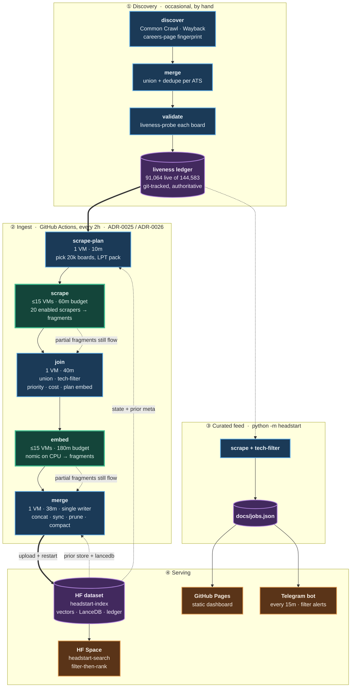

# HeadStart

Find software-engineering openings straight from companies' ATS (Applicant Tracking
System) career boards — earlier and more completely than relying on LinkedIn.

HeadStart discovers which companies host boards on which ATS, validates those boards, scrapes
them through **21 per-ATS scrapers**, normalizes everything into one `Job` shape, and serves it
two ways: a static dashboard over a curated feed, and an **AI semantic-search layer** (local
embeddings + vector search with structured filters) running live on a free-tier Hugging Face
Space over a ~200k-row index of the tech corpus.

- **Design decisions:** [`docs/adr/`](./docs/adr/) — 27 numbered ADRs (the option picked, the
  ones rejected, and why).
- **Domain glossary:** [`CONTEXT.md`](./CONTEXT.md) — the ubiquitous language (ATS, Board, Slug,
  Job, Discovery, Liveness, Feed, Doc, Bucket, GitHub VM…).
- **AI layer design + results:** [`docs/AI_Integration/`](./docs/AI_Integration/).
- **Deployment runbook:** [`docs/agents/deployment.md`](./docs/agents/deployment.md).
- **Dashboard:** GitHub Pages serves [`docs/`](./docs/) → `https://sarthakjain004.github.io/headstart/`.

## Why

LinkedIn is not a comprehensive mirror of the job market. Employers have to *opt in* to push
roles there (via ATS integrations / "job wrapping"), and that path is gated and often skipped.
So two kinds of roles slip through: ones LinkedIn never gets because the employer never
syndicated them, and ones it gets late or buries below paid listings. Reading the ATS directly
catches both. The target is companies **worldwide**, focused on **software-engineering / tech
roles**; the long tail of smaller employers (India among them) is just where the LinkedIn gap is
widest.

## How it works

Two halves share the `Job` model. A discovery pipeline finds and validates boards; a scheduled
ingest pipeline reads them and keeps the search index fresh.



Green stages are matrix fan-outs across many **GitHub VMs**; blue are single-VM serial stages;
purple are stored state. Thick `==>` edges are the main path. Dotted edges are the two things
that are easy to miss: state each stage *reads* back from the HF dataset, and the partial-work
guarantee — a shard that hits its budget still forwards what it finished.

**Discovery** runs occasionally and by hand; its output, the liveness ledger under
`data/validate/liveness/`, is committed to git and is what the ingest pipeline reads.

**Ingest** (`.github/workflows/pipeline.yml`) runs on a 2-hour cron as five stages, two of them
matrix fan-outs capped at 15 concurrent **GitHub VMs** (ADR-0025 sharded embed, ADR-0026 sharded
scrape). A run-level `concurrency` group serializes whole runs so two never race on the dataset.

**Serving** has two independent paths. The search index is the single-writer end: `merge` uploads
to the private HF dataset `imPoseidon/headstart-index` and restarts the Space
`imPoseidon/headstart-search`. Separately, `python -m headstart` scrapes the same ledger and writes
`docs/jobs.json`; the GitHub Pages dashboard and the Telegram bot (`bot.yml`, every 15 min) both
read *that* file, not the index. The two paths share the `Job` model and the tech filter but run on
their own schedules.

### Which boards a run picks

A run does not scrape every board it could. Enabled ATSes hold 66,182 live boards, of which
**51,304 are currently hiring** — `load_active_companies` defaults to `min_jobs=1`, so the 14,878
live-but-empty boards are skipped as having nothing to read. `pick_boards` takes a slice of
`--max-boards` (default **20,000**) and splits it **30/70**: the top 30% by board-priority score —
a sticky EWMA of each board's tech-job yield, kept in `data/state/board_priority.csv` (ADR-0022) —
and a random 70% exploration tail drawn from everything else, so newly-productive boards can never
starve. The tail is random over *everything* not in the head, not over unscraped boards alone, so
it re-samples known boards too; that is what keeps eviction working on boards outside the head.
Boards a run skips are simply left alone — eviction is scoped to boards actually present in the
scrape (ADR-0014), so a partial harvest never damages what it didn't look at.

### Nothing scraped is ever wasted

Both fan-out stages are time-budgeted, and both bank partial work by design. The inner
`timeout 60m` (scrape) and `timeout 180m` (embed) fire well before the step and job timeouts, and
`|| echo` absorbs the non-zero exit so the fragment still uploads. `JobWriter` flushes after every
board and `EmbeddingStore` flushes vectors then metadata after every batch, so a killed shard loses
at most the item in flight; `embed_merge` truncates any half-written tail. Whatever finished moves
to the next stage, and the unfinished boards and Docs simply reappear in the next run's plan.

### Tech-only, English-only

Every job is scraped, but only tech roles are embedded, indexed, and shown. The scrape writes the
full set to `data/jobs/{ats}.jsonl`; a recall-biased regex filter (`headstart.tech_filter`) derives
the tech subset in `data/jobs/tech/{ats}.jsonl` — **31.8% of the scraped slice** in the last
measured run, though the rate swings hard by ATS (Eightfold 52.7%, Workday 6.9%). A non-tech job
creeping in is fine; dropping a tech job is not, so a two-part verification gate guards recall: a
deterministic self-consistency check plus an independent LLM reasoning gate
(`scripts/filter/verify_tech.py`) that judges a sample of the *dropped* pile and flags any real
tech job the regex missed (ADR-0017). A `langdetect` gate then holds non-English descriptions out
of the index before embedding — the scrape and the feed keep them, only retrieval is English-only.

No always-on server: scheduled GitHub Actions, a static Pages site, and a free-tier Space.

## ATS coverage

21 scrapers, selected from a registry by the `ats` key: `ashby`, `darwinbox`, `eightfold`,
`freshteam`, `greenhouse`, `join`, `keka`, `lever`, `oracle`, `personio`, `recruitee`,
`ripplehire`, `rippling`, `sensehq`, `smartrecruiters`, `successfactors`, `teamtailor`,
`trakstar`, `workable`, `workday`, `zoho`. `join` is in `registry.DISABLED_ATS` — German-SMB
boards running ~1 tech job in ~10k, pure noise for a tech-only index — so it is skipped rather
than scraped. Its scraper class and tests stay intact; re-enable by removing it from that set.

Each scraper reads a Board and normalizes its raw postings into `Job` records; all HTTP routes
through one pooled, thread-local `curl_cffi` client that impersonates Chrome, so the same stack
serves plain JSON APIs and the TLS-fingerprinted (Cloudflare / DataDome) boards (ADR-0002). The
liveness pipeline has probed **144,583 boards**: 91,064 live, 36,703 dead, 16,814 unknown.

## AI semantic search

The search design is a **hybrid split made explicit at the UI**: the user applies structured
filters themselves (remote, employment type, max years of experience) *and separately* types a
natural-language query describing only the role. Filters drive a deterministic where-clause; the
query drives the embedding.

- **Embeddings:** `nomic-embed-text-v1.5`, 768-dim, L2-normalized. Task prefixes
  (`search_document:` / `search_query:`) are load-bearing (ADR-0005). Only `title + cleaned
  description` is embedded — structured fields ride alongside as filterable metadata, never inside
  the vector (ADR-0006). The model's context is 8192 tokens but Docs are **capped at 4096**: a
  full-context Doc transiently needs ~50 GB on the MPS stack, and only ~0.01% of the corpus is
  longer. Local runs use the Apple GPU (MPS, fp16); CI runs CPU/fp32, which is 10-40× slower and
  is why the pipeline shards embedding across 15 VMs.
- **Store + retrieval:** LanceDB, embedded and local, does filter-then-rank in one query —
  pre-filter on the typed metadata, rank the survivors by cosine (ADR-0007, ADR-0008). Required
  years-of-experience is extracted to a numeric range by a deterministic cascade so `min_years`
  is a real filter (ADR-0009, ADR-0018).
- **Freshness:** the index is reconciled incrementally, never rebuilt — `index sync` adds new
  vectors and evicts postings that vanished from a scraped board, `index prune` sweeps rows on
  dead boards and case-variant duplicates, `index compact` rewrites the table to reclaim orphan
  fragments (ADR-0014, ADR-0019, ADR-0023).
- **Résumé → query (private beta):** paste a résumé and an LLM writes the one role-describing
  query it implies, into the search box, editable before it runs — the query stays role-only
  (years/salary are scrubbed in code; those belong to filters). LLM calls go through a private
  llm-router over an SSH tunnel, gated by a beta password validated once per IP; the résumé text
  is used for that single call and never stored (ADR-0032).

### The served table

One row per Job in the LanceDB `jobs` table — the only thing the Space reads. Defined by `_schema()`
in [`src/headstart/ingest/index.py`](src/headstart/ingest/index.py); `tests/test_readme_schema.py`
fails if this table drifts from it.

| column | type | notes |
| --- | --- | --- |
| `id` | string | `{ats}:{slug}:{native_id}` — the Board key is everything before the last `:` |
| `ats` | string | `greenhouse`, `workday`, `ashby`, `darwinbox`, … |
| `company` | string | the ATS slug, not a display name |
| `title` | string | embedded, with the description |
| `location` | string | raw ATS text; the India filter maps it via a gazetteer (ADR-0024) |
| `remote` | bool | |
| `employment_type` | string | raw per-ATS text (`FullTime`, `Full Time`, `Contract`, …), normalised at query time |
| `experience` | string | raw, for display (`"2 - 5 Years"`) |
| `min_years` | int32 | parsed from `experience`; **nullable** — null means unknown, not zero (ADR-0009) |
| `max_years` | int32 | nullable |
| `experience_source` | string | `field` \| `regex` \| `seniority` \| null — how the years were derived (ADR-0018) |
| `salary` | string | raw, for display (`"INR 3 - 5 (Annual)"`) |
| `department` | string | raw ATS text |
| `url` | string | the job-detail link |
| `posted_at` | string | **the company's** posting date, straight from the ATS — inconsistent (`2026-01-09T00:46:44.672+00:00`, `06-Jan-2026`) and null on ~14% of rows |
| `first_seen` | string | **ours** — ISO-8601 UTC, stamped when `index sync` adds the row. Write-once. Null on rows predating the column (ADR-0031) |
| `vector` | list\<float32\>[768] | `title + cleaned description`, L2-normalized |

Two example rows, real values from the live index (vector elided):

```jsonc
{
  "id": "ashby:level:538c0fe2-504d-45e9-8ae6-2b44de217418",
  "ats": "ashby", "company": "level",
  "title": "Backend Engineer (senior or above)",
  "location": "Austin", "remote": false, "employment_type": "FullTime",
  "experience": null, "min_years": 5, "max_years": null, "experience_source": "seniority",
  "salary": null, "department": null,
  "url": "https://jobs.ashbyhq.com/level/538c0fe2-504d-45e9-8ae6-2b44de217418",
  "posted_at": "2026-01-09T00:46:44.672+00:00",     // ISO — this ATS is well-behaved
  "first_seen": "2026-07-28T12:58:27+00:00",
  "vector": [0.021, -0.043, /* … 768 floats … */]
}
{
  "id": "darwinbox:jslhrms:a683d2db261645",
  "ats": "darwinbox", "company": "jslhrms",
  "title": "Assistant Engineer (Central QA)",
  "location": "Jajpur, Odisha , India", "remote": false, "employment_type": "Full Time",
  "experience": "2 - 5 Years", "min_years": 2, "max_years": 5, "experience_source": "field",
  "salary": "INR 3 - 5 (Annual) (Annual)",
  "department": "Central QA - IMS, OE (0050_JSL__CQA_L177)",
  "url": "https://jslhrms.darwinbox.in/ms/candidatev2/main/careers/jobDetails/a683d2db261645",
  "posted_at": "23-Jun-2026",                        // NOT ISO — why the recency filter
  "first_seen": "2026-07-28T12:58:27+00:00",         // needs a shape guard on posted_at
  "vector": [0.013, 0.008, /* … 768 floats … */]
}
```

The second row is the reason `posted_at` and `first_seen` are separate columns rather than one
"date". `23-Jun-2026` sorts lexicographically *above* any ISO cutoff, so a naive
`posted_at >= '2026-07-01'` would let it into every window — hence the `LIKE '____-__-__%'` shape
guard on that filter, and none on `first_seen`, which we write ourselves.

Note the corpus files under `data/jobs/` carry a few fields the table does not, e.g. `scraped_at`
and the full `description`. The description is embedded, not stored — the vector is what survives
into the table.

### Retrieval eval

Ranking quality is measured, not asserted (ADR-0011). A five-stage harness in `scripts/eval/`:
pool the search's top hits per query, grade each `(query, job)` pair `0–3` with an LLM judge,
validate that judge against hand labels (quadratic-weighted Cohen's **κ ≈ 0.64**, "substantial"),
then score with `ranx` → **nDCG@10 = 0.90** on the Wellfound benchmark corpus. Two honest limits,
printed with the score: it is a single-system pool, so nDCG measures how well the search orders its
own picks, not corpus-wide recall (pooling a second system, e.g. BM25, is the named next step); and
the benchmark is kept deliberately distinct from the production tech corpus (ADR-0014, ADR-0019).
`scripts/eval/verify_filters.py` separately checks every filter's semantics and every ATS's job-link
correctness against the live Space.

## Layout

- `src/headstart/` — shared library, used by both the pipeline and the curated feed: `models.py`
  (Job + normalization), `scrapers/` (21 per-ATS + `base`/`registry`), `http.py` (the pooled
  reliable-fetch seam), `config.py`, `harvest.py` (the scrape engine — `scrape_all`, `JobWriter`,
  feed builders), `liveness.py`, `corpus.py`, `tech_filter.py` (ADR-0017), `experience.py`,
  `geo.py`, `search.py` (shared embed/search constants + filter builder), `board_priority.py`
  (ADR-0022), `board_cost.py` (measured scrape seconds, ADR-0027); plus the bot: `filters.py`,
  `bot.py`, `telegram.py`, `state.py`.
- `src/headstart/ingest/` — **the 2-hourly pipeline run**, one module per stage step, invoked as
  `python -m headstart.ingest.<module>` (ADR-0028): `scrape_plan`, `scrape`, `scrape_join`,
  `filter_tech`, `update_ledgers` (`priority`/`cost`), `embed_plan`, `embed_run`, `embed_merge`,
  `index` (`sync`/`prune`/`compact`). `.github/workflows/pipeline.yml` runs exactly these. Its
  pipeline-only helpers live here too: `binpack.py` (LPT packing shared by both planners),
  `doc_prep.py` (doc prep shared by embedder and planner), `index_plan.py` (the pure add/evict
  and prune planners).
- `scripts/` — tooling *outside* the run: `discover/`, `merge/`, `validate/`, `resolve/`,
  `scrape/` (one-off pulls), `filter/` (recall verification), plus the AI layer in `embed/`
  (local index tools), `enrich/`, `eval/`, `ui/`.
- `data/` — `validate/liveness/` is git-tracked and authoritative. **Everything else under `data/`
  is gitignored and lives in the HF dataset**, not in the repo: `state/`, `embeddings/`,
  `lancedb/`, `jobs/`. Pull them from HF before trusting any local copy.
- `deploy/hf-space/` — the Space app; `deploy-space.yml` pushes it on change, so the repo stays
  the single source of truth for what runs there.
- `docs/` — `index.html` dashboard + generated `jobs.json` (served by Pages), `adr/`,
  `AI_Integration/`, `agents/` (issue tracker, triage, domain, deployment runbooks).
- `.github/workflows/` — `pipeline.yml` (the 5-stage ingest), `pipeline-smoke.yml`, `ci.yml`
  (lint + format + tests), `bot.yml` (Telegram alerts), `deploy-space.yml`, `cleanup-index.yml`.

## Development

Requires Python 3.12+.

```bash
python -m venv .venv
source .venv/bin/activate            # Windows: .venv\Scripts\activate
pip install -e ".[dev]"
pytest                               # network-free, fixture-based
ruff check . && ruff format --check .

python -m headstart                  # curated scrape → docs/jobs.json
python -m http.server -d docs        # preview the dashboard at http://localhost:8000
```

Semantic-search demo. The corpus and embedding artifacts are gitignored — pull them from the HF
dataset first (see [`docs/agents/deployment.md`](./docs/agents/deployment.md) for auth):

```bash
pip install -e ".[embed,ui]"
python -c "from huggingface_hub import snapshot_download; snapshot_download(
    'imPoseidon/headstart-index', repo_type='dataset', local_dir='.',
    allow_patterns=['data/state/*','data/embeddings/jobs/*','data/lancedb/*'])"
python scripts/ui/serve.py                # search UI at http://localhost:8000
```

To rebuild rather than download — note `embed_run.py` is CPU-bound and belongs on CI at any real
scale (ADR-0025):

```bash
python -m headstart.ingest.embed_run --resume   # embed the English tech corpus
python -m headstart.ingest.index sync            # incremental add/evict into the LanceDB `jobs` table
```
