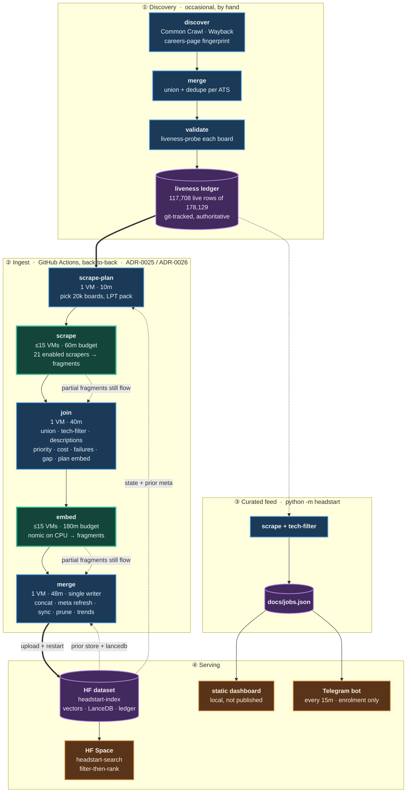

# HeadStart

[](https://github.com/sarthakjain004/headstart/actions/workflows/ci.yml)
[](https://github.com/sarthakjain004/headstart/actions/workflows/pipeline.yml)
[](./docs/adr/)
[](./pyproject.toml)

Find software-engineering openings straight from companies' ATS (Applicant Tracking
System) career boards — earlier and more completely than relying on LinkedIn.

**[Search the index](https://imposeidon-headstart-search.hf.space)** ·
**[Read the decisions](./docs/adr/)**

HeadStart discovers which companies host boards on which ATS, validates those boards, scrapes
them through **22 per-ATS scrapers**, normalizes everything into one `Job` shape, and serves it
three ways: a static dashboard over a curated feed; an **AI semantic-search layer** (local
embeddings + vector search with structured filters) running live on a free-tier Hugging Face
Space over a **320,628-row** index of the tech corpus; and **job alerts** — saved searches
delivered by email or Telegram to signed-in accounts (ADR-0035, ADR-0038).

All of it runs on free tiers (see *Cost is a design constraint*, below). The dashboard is built
into `docs/` and served locally — GitHub Pages publishing is currently off.

- **Design decisions:** [`docs/adr/`](./docs/adr/) — 92 numbered ADRs (the option picked, the
  ones rejected, and why).
- **Domain glossary:** [`CONTEXT.md`](./CONTEXT.md) — the ubiquitous language (ATS, Board, Slug,
  Job, Discovery, Liveness, Feed, Doc, Bucket, GitHub VM…).
- **AI layer design + results:** [`docs/AI_Integration/`](./docs/AI_Integration/).
- **Deployment runbook:** [`docs/agents/deployment.md`](./docs/agents/deployment.md).
- **Dashboard:** [`docs/index.html`](./docs/index.html) over generated `jobs.json`; run it locally (see Development). Not currently published.

## What this optimises for

Six commitments show up in almost every design decision here, and they are worth stating because
they explain choices that would otherwise look strange.

**Measure it; don't reason about it.** Claims about how a remote host behaves are settled by
hitting the host, not by reading code. This is a rule with a scar behind it: a "probe the host root
to tell dead from empty" guard looked obviously correct and died on contact, because 9 of 12 boards
the ledger already called dead answered `GET /` with 200. Findings carry their sample size.

**Record the rejected options, not just the chosen one.** 92 ADRs, **63** carrying a heading that
weighs alternatives (`grep -lEi '^#{2,3} .*(alternativ|options? (considered|rejected)|rejected)'`).
When a later measurement contradicts an earlier one the ADR is amended or superseded in place
rather than quietly edited — **34** name an `Amends:` / `Supersedes:` relationship in their header —
so the reasoning stays auditable even when it turns out to be wrong.

**Publish the limits next to the result.** The retrieval score ships with the two reasons not to
over-trust it. Coverage tables say what is excluded and why. A number without its caveat is treated
as a defect.

**Degrade where degrading is possible.** A missing binary, an unregistered client, a walled
origin: the spare egress returns "not available" and leaves the caller on the path it already had,
because a fallback is worth having only if its absence costs nothing. Not universal — `llm_router`
and `browser_http` raise, and `state_fetch` aborts the run, because a stage that silently proceeds
without its inputs would publish a wrong answer rather than no answer.

**Recall over precision, where the two conflict.** The tech filter tolerates non-tech creep and
refuses to drop a real tech job. `scripts/filter/verify_tech.py` exists to audit the *discarded*
pile with an independent LLM gate — but it is run by hand, not wired into the pipeline, so treat it
as a tool that has been used rather than a check that runs.

**Cost is a design constraint, not an afterthought.** The whole system runs on free tiers, so
storage and minutes bound the architecture directly — that is why compaction moved out of the
back-to-back run into its own daily one, why embedding shards across 15 VMs, and why a run takes a
20,000-board slice rather than scraping exhaustively (30% by measured yield, 70% random
exploration, so a newly-productive board can never starve).

## Why

LinkedIn is not a comprehensive mirror of the job market. Employers have to *opt in* to push
roles there (via ATS integrations / "job wrapping"), and that path is gated and often skipped.
So two kinds of roles slip through: ones LinkedIn never gets because the employer never
syndicated them, and ones it gets late or buries below paid listings. Reading the ATS directly
catches both. The target is companies **worldwide**, focused on **software-engineering / tech
roles**; the long tail of smaller employers (India among them) is just where the LinkedIn gap is
widest.

## How it works

Two halves share the `Job` model. A discovery pipeline finds and validates boards; a scheduled
ingest pipeline reads them and keeps the search index fresh.



Green stages are matrix fan-outs across many **GitHub VMs**; blue are single-VM serial stages;
purple are stored state. Thick `==>` edges are the main path. Dotted edges are the two things
that are easy to miss: state each stage *reads* back from the HF dataset, and the partial-work
guarantee — a shard that hits its budget still forwards what it finished.

**Discovery** runs occasionally and by hand; its output, the liveness ledger under
`data/validate/liveness/`, is committed to git and is what the ingest pipeline reads.

**Ingest** (`.github/workflows/pipeline.yml`) runs back-to-back (ADR-0071) as five stages, two of them
matrix fan-outs capped at 15 concurrent **GitHub VMs** (ADR-0025 sharded embed, ADR-0026 sharded
scrape). A run-level `concurrency` group serializes whole runs so two never race on the dataset.

**Serving** has two independent paths. The search index is the single-writer end: `merge` uploads
to the private HF dataset `imPoseidon/headstart-index` and restarts the Space
`imPoseidon/headstart-search`. Separately, `python -m headstart` scrapes the same ledger and writes
`docs/jobs.json`; the static dashboard reads *that* file, not the index. The two paths share the `Job` model and the tech filter but run on
their own schedules.

### Which boards a run picks

A run does not scrape every board it could, and the ledger's headline number is not the number
that matters. The 117,708 live *rows* reduce to 85,611 **Scrapable Boards** a run can even
consider (measured 2026-09-06; the terms are defined in `CONTEXT.md` §Counting Boards):

| | boards | |
| --- | ---: | --- |
| live rows in the ledger | 117,708 | a row, not a board — 6,617 of them are duplicate spellings |
| − `registry.DISABLED_ATS` | −25,416 | **all of it `join`** — German-SMB boards at ~1 tech job in ~10k |
| − `config.EXCLUDED_BOARDS` | −40 | vendor test/sandbox boards, confirmed by reading their postings |
| − alias ledger | −23 | one company, two hostnames — `basf.jobs` and `basf-se.jobs2web.com` are one board (ADR-0111) |
| − case-variant dedupe | −6,615 | `company/External` and `company/external` are one board (ADR-0023) |
| − `config.PARKED_BOARDS` | −3 | real boards withheld for now — Accenture's and EY's outrun any shard budget, and SmartRecruiters' `AdeebaEServicesPvtLtd` cost 24 min a run for 136 tech jobs |
| = **Scrapable Board** | **85,611** | |

That order matters: excluding before deduping reads −40 and −6,615, deduping first reads −38 and
−6,617, because two excluded boards were themselves duplicates. Both land on 85,611.

The alias row is the one stage that is not derivable from the ledger's own text: two hostnames
serving one board share no key to collapse on, so it takes a live probe to find them
(`scripts/validate/dedupe_boards.py`, ADR-0111).

Of those, **53,815 are currently hiring** — `load_active_companies` defaults to `min_jobs=1`, so
the 31,796 live-but-empty boards are skipped as having nothing to read. `pick_boards` takes a
slice of
`--max-boards` (default **20,000**) and splits it **30/70**: the top 30% by board-priority score —
a sticky EWMA of each board's tech-job yield, kept in `data/state/board_priority.csv` (ADR-0022) —
and a random 70% exploration tail drawn from everything else, so newly-productive boards can never
starve. The tail is random over *everything* not in the head, not over unscraped boards alone, so
it re-samples known boards too; that is what keeps eviction working on boards outside the head.

A slice of that exploration tail — `GAP_FRAC`, 5%, so ~700 boards — is reserved for boards holding
**unsettled descriptions** (ADR-0062): jobs already in the store whose text we have never held, and
whose experience numbers therefore cannot be repaired without scraping the board again. There are
6,153 such boards holding 41,353 jobs, and the priority ordering would otherwise never reach
them. `data/state/board_description_gap.csv` is recomputed every run, so a board leaves it as soon
as its descriptions settle and the reservation cancels itself once the backlog drains.
Boards a run skips are simply left alone — eviction is scoped to boards actually present in the
scrape (ADR-0014), so a partial harvest never damages what it didn't look at.

### Nothing scraped is ever wasted

Both fan-out stages are time-budgeted, and both bank partial work by design. The inner
`timeout 60m` (scrape) and `timeout 180m` (embed) fire well before the step and job timeouts, and
`|| echo` absorbs the non-zero exit so the fragment still uploads. `JobWriter` flushes after every
board and `EmbeddingStore` flushes vectors then metadata after every batch, so a killed shard loses
at most the item in flight; `embed_merge` truncates any half-written tail. Whatever finished moves
to the next stage, and the unfinished boards and Docs simply reappear in the next run's plan.

### Tech-only, English-only

Every job is scraped, but only tech roles are embedded, indexed, and shown. The scrape writes the
full set to `data/jobs/{ats}.jsonl`; a recall-biased regex filter (`headstart.tech_filter`) derives
the tech subset in `data/jobs/tech/{ats}.jsonl` — **241,602 of 1,261,562 scraped rows, 19.2%**, in
run 32114156695 (2026-08-18 — a stale figure by construction: `data/jobs/` is ephemeral stage
output with no durable source, so it cannot be refreshed without a re-run), though the rate swings hard by ATS (Freshteam 56.4%, Ashby 42.4%,
Eightfold 40.8%, SuccessFactors 11.8%, Workday 11.8%). A non-tech job
creeping in is fine; dropping a tech job is not, so a two-part verification gate guards recall: a
deterministic self-consistency check plus an independent LLM reasoning gate
(`scripts/filter/verify_tech.py`) that judges a sample of the *dropped* pile and flags any real
tech job the regex missed (ADR-0017). A `langdetect` gate then holds non-English descriptions out
of the index before embedding — the scrape and the feed keep them, only retrieval is English-only.

No always-on server: scheduled GitHub Actions and a free-tier Space.

## ATS coverage

22 scrapers, selected from a registry by the `ats` key: `ashby`, `darwinbox`, `eightfold`,
`freshteam`, `greenhouse`, `join`, `keka`, `lever`, `oracle`, `personio`, `recruitee`,
`ripplehire`, `rippling`, `sensehq`, `smartrecruiters`, `successfactors`, `teamtailor`,
`trakstar`, `workable`, `workday`, `zoho`, `zwayam`. `join` is in `registry.DISABLED_ATS` — German-SMB
boards running ~1 tech job in ~10k, pure noise for a tech-only index — so it is skipped rather
than scraped. Its scraper class and tests stay intact; re-enable by removing it from that set.

Each scraper reads a Board and normalizes its raw postings into `Job` records; all HTTP routes
through one pooled, thread-local `curl_cffi` client that impersonates Chrome, so the same stack
serves plain JSON APIs and the TLS-fingerprinted (Cloudflare / DataDome) boards (ADR-0002). The
liveness pipeline has probed **178,129 ledger rows**: 117,708 live, 52,941 dead, 7,480 unknown —
rows, not boards; they collapse to 111,091 Unique Boards (CONTEXT.md §Counting Boards). Of the
22 scrapers, 19 have rows in the index — `oracle` and `sensehq` are single-company unlocks with
nothing indexed yet, `zwayam` was added 2026-08-27 and has not run in the pipeline yet, and
`join`'s remaining 1,093 rows are a residue of the era before it was disabled: no slice will
scrape them again, so they leave by eviction rather than refresh.

## AI semantic search

The search design is a **hybrid split made explicit at the UI**: the user applies structured
filters themselves *and separately* types a natural-language query describing only the role.
Filters drive a deterministic where-clause; the query drives the embedding. `/search` takes
`remote`, `has_salary`, `max_years`, `ats`, `etype`, `india`, `location`, `company`,
`posted_within`, `seen_within`, the four custom bounds `posted_after` / `posted_before` /
`seen_after` / `seen_before`, and the alerts-only `first_seen_after` — all compiled by
`search.build_filter`, which rejects unparseable input with a 400 rather than ignoring it.

- **Embeddings:** `nomic-embed-text-v1.5`, 768-dim, L2-normalized. Task prefixes
  (`search_document:` / `search_query:`) are load-bearing (ADR-0005). Only `title + cleaned
  description` is embedded — structured fields ride alongside as filterable metadata, never inside
  the vector (ADR-0006). The model's context is 8192 tokens but Docs are **capped at 4096**: a
  full-context Doc transiently needs ~50 GB on the MPS stack, and only ~0.01% of the corpus is
  longer. Local runs use the Apple GPU (MPS, fp16); CI runs CPU/fp32, which is 10-40× slower and
  is why the pipeline shards embedding across 15 VMs.
- **Store + retrieval:** LanceDB, embedded and local, does filter-then-rank in one query —
  pre-filter on the typed metadata, rank the survivors by cosine (ADR-0007, ADR-0008). Required
  years-of-experience is extracted to a numeric range by a deterministic cascade so `min_years`
  is a real filter (ADR-0009, ADR-0018).
- **Freshness:** the index is reconciled incrementally, never rebuilt — `index sync` adds new
  vectors, evicts postings that vanished from a scraped board, and carries corrected metadata into
  rows it already holds; `index prune` sweeps rows on dead boards and case-variant duplicates
  (ADR-0014, ADR-0019, ADR-0023, ADR-0061). `index compact` rewrites the whole table to reclaim
  orphan fragments and so runs in `cleanup-index`, **not** in the ingest run — rewriting ~1.9 GB
  once per run is what the storage budget cannot afford.
- **Correctness over time:** stored metadata is not frozen at embed time. Facts (salary, location,
  remote…) are re-observed from each scrape, and the derived experience numbers are recomputed when
  the extractor changes or when a description arrives after the fact (ADR-0061, ADR-0062) — so a
  fix reaches rows already embedded instead of new jobs only.
- **Signed in:** the whole UI sits behind Google sign-in once `SECRET_KEY` and `GOOGLE_CLIENT_ID`
  are set (ADR-0042) — a signed cookie, `SameSite=Lax` instead of CSRF tokens, which is also why
  the app only works at its own URL and not inside the huggingface.co Spaces iframe. Signing in
  unlocks three per-account tabs: **Matches** (Saved sets, one of which projects into the email
  Subscription, ADR-0043), **Saved** (starred jobs kept as display copies so a closed posting
  still renders, ADR-0044), and **Profile** (ADR-0041).
- **Profile:** paste a résumé and one LLM call extracts the stored career record and the single
  role-describing query it implies, editable before it runs — the query stays role-only
  (years/salary are scrubbed in code; those belong to filters). Capped at three parses per account
  for its lifetime, counted in its own single-writer file so a racing save cannot refill it. The
  pasted text is used for that one call and never stored. LLM calls go through the private
  llm-router; if it is unreachable that endpoint 503s on its own rather than taking the app down.

### The served table

One row per Job in the LanceDB `jobs` table — the only thing the Space reads. Defined by `_schema()`
in [`src/headstart/ingest/index.py`](src/headstart/ingest/index.py); `tests/test_readme_schema.py`
fails if this table drifts from it.

| column | type | notes |
| --- | --- | --- |
| `id` | string | `{ats}:{slug}:{native_id}` — the Board key is everything before the last `:` |
| `ats` | string | `greenhouse`, `workday`, `ashby`, `darwinbox`, … |
| `company` | string | the ATS slug, not a display name |
| `title` | string | embedded, with the description |
| `description` | string | the Job's description text, so the Keyword filter can match inside it (ADR-0104). **Nullable** — null on rows indexed before the column existed and on Jobs whose detail pass found nothing, so the Keyword filter's description scope reaches only part of the table, and the UI reports the share. Stored, not served: the API omits it |
| `location` | string | raw ATS text; the India filter maps it via a gazetteer (ADR-0024) |
| `remote` | bool | |
| `employment_type` | string | raw per-ATS text (`FullTime`, `Full Time`, `Contract`, …), normalised at query time |
| `experience` | string | raw, for display (`"2 - 5 Years"`) |
| `min_years` | int32 | parsed from `experience`; **nullable** — null means unknown, not zero (ADR-0009) |
| `max_years` | int32 | nullable |
| `experience_source` | string | `field` \| `regex` \| `seniority` \| null — how the years were derived (ADR-0018) |
| `salary` | string | raw, for display (`"INR 3 - 5 (Annual)"`) |
| `min_salary_annual` | int32 | parsed from `salary` or the description; period-normalized to an annual figure in the job's native currency; **nullable** — null means unknown, not zero (ADR-0082) |
| `max_salary_annual` | int32 | nullable — open-ended when only a floor is stated |
| `salary_currency` | string | ISO 4217 code where determinable (`"USD"`, `"INR"`, `"EUR"`, …); null if a number was found but the currency wasn't |
| `salary_source` | string | `field` \| `regex` \| null — how it was derived; no seniority-style tier exists for salary (ADR-0082) |
| `department` | string | raw ATS text |
| `url` | string | the job-detail link |
| `posted_at` | string | **the company's** posting date, straight from the ATS — inconsistent (`2026-01-09T00:46:44.672+00:00`, `03-Jul-2026`) and **null on 13.4%** of rows (measured over 481,396 rows of the embedding *store* — not the served index — on 2026-08-18, when the store held that many; it holds **572,871** today; an earlier 1,000-row sample read 29%, which the full count corrects) |
| `first_seen` | string | **ours** — ISO-8601 UTC, stamped when `index sync` adds the row. Write-once, and null on rows added before the column existed (ADR-0031). Measured **null on 77%** of a 1,000-row sample (2026-08-18), so the "new since" filter reached under a quarter of the table then |
| `vector` | list\<float32\>[768] | `title + cleaned description`, L2-normalized |

Two example rows, fetched from the live index on 2026-08-12 (signed in — `/search` 401s an
anonymous caller) — exactly as `/search` projects them, which is why `experience`, `max_years`,
`experience_source`, `department` and the vector do not appear: the API omits those, though the
table stores them. They predate `min_salary_annual`/`max_salary_annual`/`salary_currency`/
`salary_source` (ADR-0082) and this session has no signed-in credential to re-fetch a live row —
they're left as-is rather than fabricated; a future update should replace them with a row that
actually carries salary data once the pipeline has run against it.

```jsonc
{
  "id": "ashby:level:538c0fe2-504d-45e9-8ae6-2b44de217418",
  "ats": "ashby", "company": "level",
  "title": "Backend Engineer (senior or above)",
  "description": null,                               // indexed before ADR-0104 added the column
  "location": "Austin", "remote": false, "employment_type": "FullTime",
  "min_years": 5, "salary": null,
  "url": "https://jobs.ashbyhq.com/level/538c0fe2-504d-45e9-8ae6-2b44de217418",
  "posted_at": "2026-01-09T00:46:44.672+00:00",     // ISO — this ATS is well-behaved
  "first_seen": null                                 // indexed before ADR-0031 added the column
}
{
  "id": "darwinbox:jslhrms:a65a11b3d9c70e",
  "ats": "darwinbox", "company": "jslhrms",
  "title": "Junior Engineer (Central QA)",
  "description": null,                               // likewise
  "location": "Jajpur, Odisha , India",              // raw ATS text, stray spacing and all
  "remote": false, "employment_type": "Full Time",
  "min_years": 1, "salary": null,
  "url": "https://jslhrms.darwinbox.in/ms/candidatev2/main/careers/jobDetails/a65a11b3d9c70e",
  "posted_at": "03-Jul-2026",                        // NOT ISO — why the recency filter
  "first_seen": null                                 // needs a shape guard on posted_at
}
```

The second row is the reason `posted_at` and `first_seen` are separate columns rather than one
"date". `23-Jun-2026` sorts lexicographically *above* any ISO cutoff, so a naive
`posted_at >= '2026-07-01'` would let it into every window — hence the `LIKE '____-__-__%'` shape
guard on that filter, and none on `first_seen`, which we write ourselves.

Note the corpus files under `data/jobs/` carry a few fields the table does not, e.g. `scraped_at`.
The description is embedded into the vector **and**, since ADR-0104, stored in its own column so the
Keyword filter can match inside it — but it is not served: the API projection omits it.

### Retrieval eval

Ranking quality is measured, not asserted (ADR-0011). A five-stage harness in `scripts/eval/`:
pool the search's top hits per query, grade each `(query, job)` pair `0–3` with an LLM judge,
validate that judge against hand labels (quadratic-weighted Cohen's **κ ≈ 0.64**, "substantial"),
then score with `ranx` → **nDCG@10 = 0.90** on the Wellfound benchmark corpus. Two honest limits,
printed with the score: it is a single-system pool, so nDCG measures how well the search orders its
own picks, not corpus-wide recall (pooling a second system, e.g. BM25, is the named next step); and
the benchmark is kept deliberately distinct from the production tech corpus (ADR-0014, ADR-0019).
`scripts/eval/verify_filters.py` separately checks every filter's semantics and every ATS's job-link
correctness against the live Space — signed in, since the wall 401s an anonymous caller. It fails
the run on a dead link (404/410), a wrong-shaped or wrong-job link, or an ATS with no shape
registered; bot walls (403/429) stay advisory.

## Layout

- `src/headstart/` — shared library, used by both the pipeline and the curated feed: `models.py`
  (Job + normalization), `scrapers/` (22 per-ATS + `base`/`registry`), `http.py` (the pooled
  reliable-fetch seam), `config.py`, `harvest.py` (the scrape engine — `scrape_all`, `JobWriter`,
  feed builders), `liveness.py`, `corpus.py`, `tech_filter.py` (ADR-0017), `experience.py`,
  `geo.py`, `search.py` (shared embed/search constants + filter builder), `board_priority.py`
  (ADR-0022), `board_cost.py` (measured scrape seconds, ADR-0027); `salary.py` (the two-tier
  extraction cascade, ADR-0082), `facets.py` (filter-shaped facet counts, ADR-0084), `roles.py`
  and `profile_extract.py`; plus `telegram_bot_api.py`, the polling client the enrolment bot uses.
- **Getting past walls**, the part with the most measurement behind it: `spare_egress.py` — a
  second network origin for a shard whose ATS budget is spent, dialling Cloudflare WARP in proxy
  mode and rotating the egress address when a host refuses it (ADR-0063, ADR-0067, ADR-0081,
  ADR-0090, ADR-0092); `browser_http.py`, its browser twin, for the hosts that admit a genuine
  Chrome and nothing else (ADR-0056); and `llm_router.py`, the one seam every LLM call goes
  through (ADR-0032).
- `src/headstart/ui/` — the templates and static assets the Space serves (ADR-0042).
- `src/headstart/alerts/` — job alerts (ADR-0035, ADR-0038) plus the signed-in per-account
  records: `store` (Subscriptions, Saved sets, Saved jobs and Profiles — the name now undersells
  it), `registry`, `access` (the invite allowlist), `identity` (Google token verification),
  `transports` (which channel delivers a Digest), `mail` and `telegram` (the senders), `bot`
  (Telegram enrolment), `digest`, `shortlist`, `space_query`, `run`.
- `src/headstart/ingest/` — **the back-to-back pipeline run**, one module per stage step, invoked as
  `python -m headstart.ingest.<module>` (ADR-0028): `scrape_plan`, `scrape_run`, `scrape_join`,
  `filter_tech`, `update_descriptions` (ADR-0050), `update_ledgers`
  (`priority`/`cost`/`failures`/`gap`), `embed_plan`, `embed_run`, `embed_merge`, `update_meta`
  (ADR-0061), `index` (`sync` then `prune`), `role_trends` (ADR-0040).
  `.github/workflows/pipeline.yml` runs exactly these — `index compact` is a subcommand of the same
  module but belongs to `cleanup-index`, not this run. Its pipeline-only helpers live here too:
  `binpack.py` (LPT packing shared by both planners), `doc_prep.py` (doc prep shared by embedder and
  planner), `index_plan.py` (the pure add/evict and prune planners), `shard_speedup.py` (the
  measured fan-out speedup the makespan divides by, ADR-0054), the per-board ledgers
  `board_failures.py` (ADR-0058) and `board_description_gap.py` (ADR-0062), `role_assignments.py`
  (ADR-0057), `observability.py` (run context, step summaries and the per-shard reports the join
  aggregates), `state_fetch.py` (ADR-0030).
- `scripts/` — tooling *outside* the run: `discover/`, `merge/`, `validate/`, `resolve/`,
  `scrape/` (one-off pulls), `filter/` (recall verification), `fetch/` (pull HF data down),
  `runlog/` (post-hoc analysis of a fan-out run's logs), plus `alerts/`, `bench/` (performance
  measurement), and the AI layer in `embed/` (local index tools), `enrich/`, `eval/`, `ui/`.
- `data/` — `validate/liveness/` is git-tracked and authoritative. **Everything else under `data/`
  is gitignored and lives in the HF dataset**, not in the repo: `state/`, `embeddings/`,
  `lancedb/`, `jobs/`. Pull them from HF before trusting any local copy.
- `deploy/hf-space/` — the Space app; `deploy-space.yml` pushes it on change, so the repo stays
  the single source of truth for what runs there.
- `docs/` — `index.html` dashboard + generated `jobs.json` (local; Pages publishing is off), `adr/`,
  `AI_Integration/`, `agents/` (issue tracker, triage, domain, deployment runbooks).
- `.github/workflows/` — `pipeline.yml` (the 5-stage ingest), `pipeline-smoke.yml`, `ci.yml`
  (lint + format + tests), `alerts.yml` and `bot.yml` (email/Telegram alerts), `deploy-space.yml`,
  `cleanup-index.yml`, `cluster-roles.yml`, `squash-dataset-history.yml`, and the two embed
  benchmarks `embed-bench.yml` / `embed-threads.yml`.

## Development

Requires Python 3.12+.

```bash
python -m venv .venv
source .venv/bin/activate            # Windows: .venv\Scripts\activate
pip install -e ".[dev]"
pytest                               # network-free, fixture-based
ruff check . && ruff format --check .

python -m headstart                  # curated scrape → docs/jobs.json
python -m http.server -d docs        # preview the dashboard at http://localhost:8000
```

Semantic-search demo. The corpus and embedding artifacts are gitignored — pull them from the HF
dataset first (see [`docs/agents/deployment.md`](./docs/agents/deployment.md) for auth):

```bash
pip install -e ".[embed,ui]"
python -c "from huggingface_hub import snapshot_download; snapshot_download(
    'imPoseidon/headstart-index', repo_type='dataset', local_dir='.',
    allow_patterns=['data/state/*','data/embeddings/jobs/*','data/lancedb/*'])"
python scripts/ui/serve.py                # search UI at http://localhost:8000
```

To rebuild rather than download — note `embed_run.py` is CPU-bound and belongs on CI at any real
scale (ADR-0025):

```bash
python -m headstart.ingest.embed_run --resume   # embed the English tech corpus
python -m headstart.ingest.index sync            # incremental add/evict into the LanceDB `jobs` table
```
